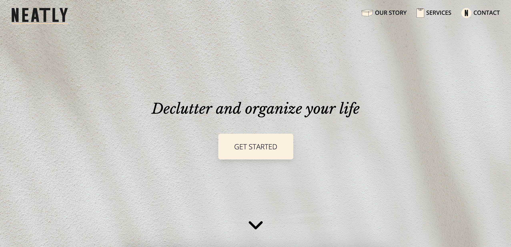

# Neatly-LandingPage
A responsive landing page using HTML and Sass. This was a school assignment where we were tasked to create a visual identity, wireframes and mockups. The assignment was focused on graphic design rather than functionality.

Live Site URL: https://malin-nilsson.github.io/Neatly-LandingPage/

